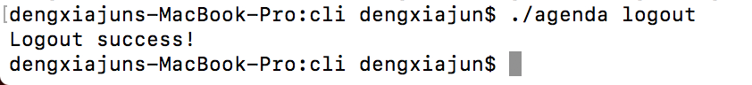
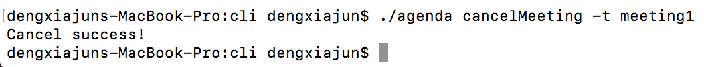

# upgraded-agenda

upgraded agenda, client and server.

---

### CLI客户端命令使用说明

- user register

 `$ ./agenda register -u username -p password -e email -t teltephone`
- user login

  `$ ./agenda login -u username -p password`
- user logout

 `$ ./agenda logout`
- list all user

  `$ ./agenda listUser`
- delete user

  `$ ./agenda deleteUser`
- create meeting

  `$ ./agenda createMeeting -t title -p 'participant1 participant2 ...' -s startTime -e endTime`
- modify meeting's participants(-a for add, -d for delete)

  `$ ./agenda modifyMeeting -a 'participants1 participant2 ...' -d 'participant1 participant2 ...'`
- query meetings

  `$ ./agenda queryMeeting -s startTime -e endTime`
- cancel meeting

  `$ ./agenda cancelMeeting -t title`
- quit meeting

  `$ ./agenda quitMeeting -t title`
- clear all meetings

  `$ ./agenda clearMeeting`

### CLI Mock 测试
利用API Blueprint提供的mock服务器，可以在没有服务器的情况下单独测试。
下面测试结果均是向mock服务器请求的结果。

- user Register

- user Login

- user Logout

如果此时没有登陆用户，则登出失败。

**以下功能都需要处于登陆状态，否则会提示没有用户登陆，不可操作**

- list users

- delete user

- create meeting

如果参数格式中有不正确的，会报错而不能创建，这里给出时间格式不正确的例子。

- modify meeting

- query meeting

- cancel meeting

如果没有指定会议名称的话，会报错，下面的命令也是如此。

- quit meeting

- clear meeting

